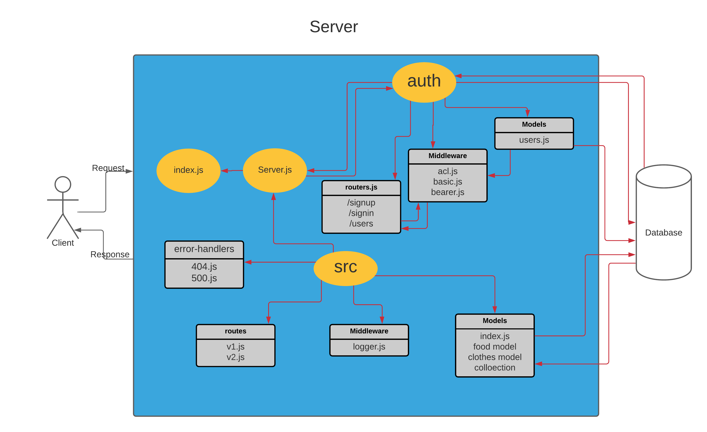

# auth-api

- It is a server compines between `api-server` and `auth-server`, but controlling access at a more granular level is vital to creating a scalable system. In this lab, you will implement Role Based Access Control (RBAC) using an Access Control List (ACL), allowing to not only restrict access to routes for valid users, but also based on the individual permissions we give each user.

---

## How to Build?

1. Create a new repo and go to action then select node.js workflow for CI.

2. Clone it to your local machine and create Package.json and add server.js and index.js.

3. Install the backages.

4. follow the design pattern in the repo and write your own code.

**important note ❗**: You should follow the structure for testing purposes and best practices.

---

## Links

[Main branch deployed on heroku](https://wesam-auth-api.herokuapp.com/)

[Pull request from dev branch to main](https://github.com/Wesam-Alqawasmeh/auth-api/pull/1)

[GitHub actions](https://github.com/Wesam-Alqawasmeh/auth-api/actions)

--- 

## UML

